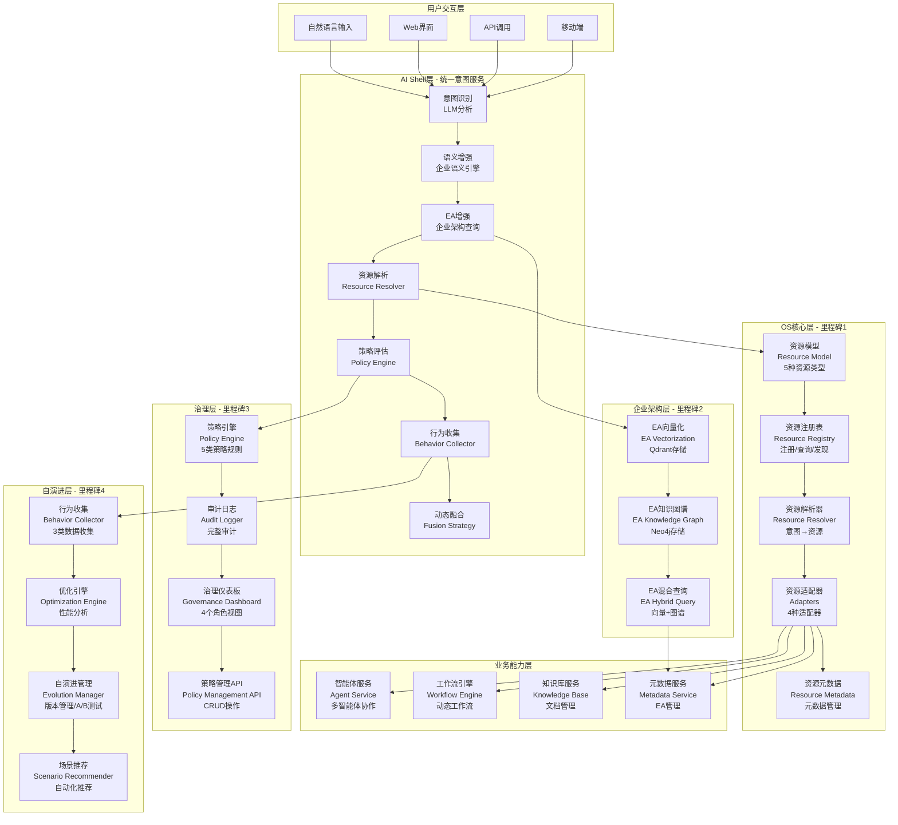
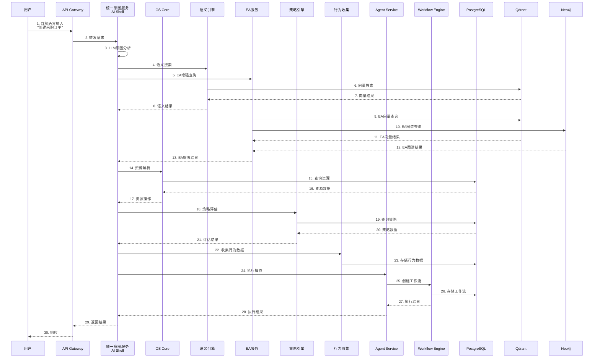
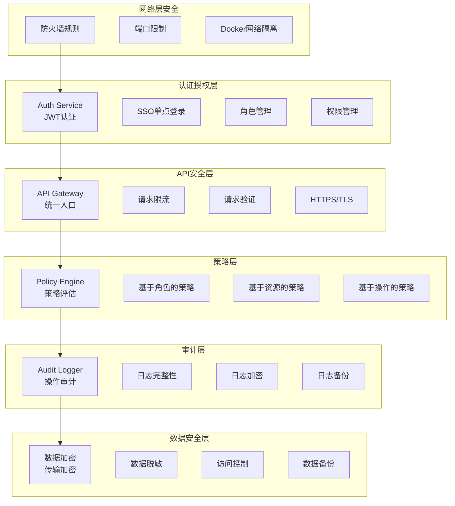
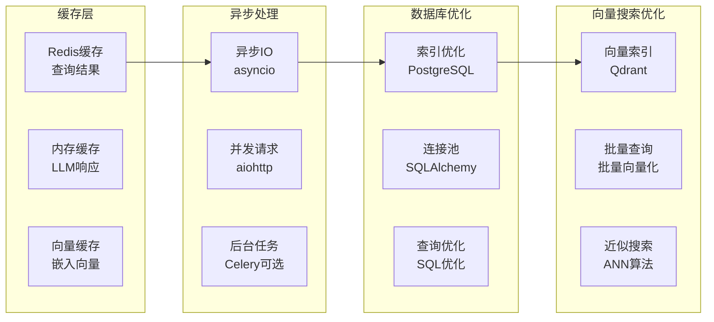
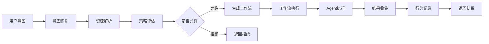
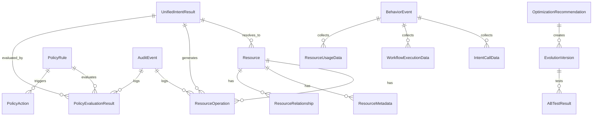

# LuminaOS平台 - 架构图详细说明

**文档版本**: 1.0.0  
**生成日期**: 2025-12-16

---

## 🏗️ 系统架构图（详细版）

### 完整系统架构

```mermaid
graph TB
    subgraph "用户层"
        UI[Web UI<br/>Next.js 14<br/>Port: 3000]
        Mobile[移动端<br/>可选]
    end
    
    subgraph "API网关层"
        Gateway[API Gateway<br/>FastAPI<br/>Port: 8080]
        Registry[Registry Service<br/>服务注册<br/>Port: 8000]
        Config[Config Center<br/>配置中心<br/>Port: 8090]
    end
    
    subgraph "AIOS核心层 - 里程碑1-4"
        subgraph "OS Core - 里程碑1"
            OS[OS Core<br/>统一资源抽象层]
            ResModel[Resource Model<br/>资源模型]
            ResReg[Resource Registry<br/>资源注册表]
            ResResolver[Resource Resolver<br/>资源解析器]
            Adapters[Resource Adapters<br/>资源适配器]
        end
        
        subgraph "AI Shell - 统一意图服务"
            Intent[Unified Intent Service<br/>统一意图服务<br/>AI Shell]
            LLM[LLM Client<br/>LLM客户端]
        end
        
        subgraph "语义引擎"
            Semantic[Enterprise Semantic Engine<br/>企业语义引擎]
        end
        
        subgraph "EA服务 - 里程碑2"
            EAVec[EA Vectorization<br/>EA向量化]
            EAGraph[EA Knowledge Graph<br/>EA知识图谱]
            EAQuery[EA Hybrid Query<br/>EA混合查询]
        end
        
        subgraph "策略治理 - 里程碑3"
            Policy[Policy Engine<br/>策略引擎]
            Audit[Audit Logger<br/>审计日志]
            Gov[Governance Dashboard<br/>治理仪表板]
        end
        
        subgraph "自演进 - 里程碑4"
            Behavior[Behavior Collector<br/>行为收集器]
            Optimize[Optimization Engine<br/>优化引擎]
            Evolution[Evolution Manager<br/>自演进管理器]
            Scenario[Scenario Recommender<br/>场景推荐]
        end
    end
    
    subgraph "业务服务层"
        Agent[Agent Service<br/>智能体服务<br/>Port: 8010]
        Workflow[Workflow Engine<br/>工作流引擎<br/>Port: 8002]
        Knowledge[Knowledge Base<br/>知识库<br/>Port: 8004]
        Metadata[Metadata Service<br/>元数据服务<br/>Port: 8005]
        Auth[Auth Service<br/>认证服务<br/>Port: 8003]
        Chat[Chat Service<br/>聊天服务<br/>Port: 8006]
        MCP[MCP Gateway<br/>MCP工具网关<br/>Port: 8001]
    end
    
    subgraph "编排层"
        AgentOrch[Agent Orchestrator<br/>智能体编排<br/>Port: 8011]
        AgentReg[Agent Registry<br/>智能体注册<br/>Port: 8012]
        DAGOrch[DAG Orchestrator<br/>DAG编排<br/>Port: 8009]
    end
    
    subgraph "基础设施层"
        Postgres[(PostgreSQL 15<br/>关系数据库<br/>Port: 5432)]
        Redis[(Redis 7<br/>缓存<br/>Port: 6379)]
        Qdrant[(Qdrant<br/>向量数据库<br/>Port: 6333)]
        Neo4j[(Neo4j 5<br/>图数据库<br/>Port: 7474/7687)]
    end
    
    subgraph "集成层"
        SAP[SAP OData MCP<br/>SAP集成<br/>Port: 3001]
        SAPMeta[SAP Metadata Agent<br/>SAP元数据代理<br/>Port: 8015]
    end
    
    UI --> Gateway
    Gateway --> Registry
    Gateway --> Intent
    Gateway --> Auth
    
    Intent --> OS
    Intent --> Semantic
    Intent --> Policy
    Intent --> Behavior
    
    OS --> ResModel
    OS --> ResReg
    OS --> ResResolver
    OS --> Adapters
    
    Semantic --> EAVec
    Semantic --> EAGraph
    Semantic --> EAQuery
    
    EAVec --> Qdrant
    EAGraph --> Neo4j
    EAQuery --> EAVec
    EAQuery --> EAGraph
    
    Policy --> Audit
    Gov --> Audit
    Audit --> Postgres
    
    Behavior --> Postgres
    Optimize --> Behavior
    Evolution --> Optimize
    Scenario --> Behavior
    
    Intent --> Agent
    Intent --> Workflow
    Intent --> Knowledge
    Intent --> Metadata
    
    Adapters --> Agent
    Adapters --> Workflow
    Adapters --> Knowledge
    Adapters --> Metadata
    
    Agent --> AgentOrch
    Agent --> AgentReg
    Agent --> Workflow
    Agent --> MCP
    
    Workflow --> DAGOrch
    Workflow --> Postgres
    
    Metadata --> Postgres
    Metadata --> Qdrant
    Metadata --> Neo4j
    
    Knowledge --> Postgres
    Knowledge --> Qdrant
    
    SAP --> MCP
    SAPMeta --> Metadata
    
    Gateway --> Redis
    Agent --> Redis
    Metadata --> Redis
    Registry --> Redis
    Config --> Redis
```



---

## 🎯 功能架构图（详细版）

### 功能分层架构



---

## 🔄 数据流架构（详细版）

### 完整数据流



---

## 📊 技术架构详细说明

### 技术栈分层

#### 1. 前端技术栈
- **框架**: Next.js 14
- **语言**: TypeScript
- **UI库**: React
- **状态管理**: React Context / Zustand
- **HTTP客户端**: Fetch API / Axios

#### 2. API网关技术栈
- **框架**: FastAPI
- **服务器**: Uvicorn
- **认证**: JWT
- **限流**: Redis-based rate limiting
- **熔断**: Circuit breaker pattern

#### 3. 核心服务技术栈
- **框架**: FastAPI
- **异步**: asyncio / aiohttp
- **ORM**: SQLAlchemy
- **数据验证**: Pydantic
- **LLM**: LangChain + OpenAI API

#### 4. 数据存储技术栈
- **关系数据库**: PostgreSQL 15 + SQLAlchemy
- **缓存**: Redis 7
- **向量数据库**: Qdrant + sentence-transformers
- **图数据库**: Neo4j 5 + Cypher

#### 5. 工作流技术栈
- **框架**: LangGraph
- **执行引擎**: LangChain
- **状态管理**: PostgreSQL

#### 6. 容器化技术栈
- **容器**: Docker
- **编排**: Docker Compose
- **网络**: Docker Network (enterprise-ai-network)

---

## 🔐 安全架构详细说明

### 安全层次



---

## 📈 性能架构

### 性能优化策略



---

## 🎯 部署架构

### 部署拓扑详细说明

```
生产环境部署架构
├── 服务器: 43.143.139.197
│   ├── Docker Compose
│   │   ├── 27个服务容器
│   │   ├── 统一网络: enterprise-ai-network
│   │   └── 数据卷管理
│   │
│   ├── 数据持久化
│   │   ├── PostgreSQL数据卷
│   │   ├── Redis数据卷
│   │   ├── Qdrant数据卷
│   │   └── Neo4j数据卷
│   │
│   └── 代码部署
│       ├── /opt/enterprise-ai-platform
│       ├── os-core/ (里程碑1-4代码)
│       ├── services/ (核心服务)
│       └── tests/ (测试文件)
│
└── 本地开发环境
    ├── Docker Desktop
    ├── 本地代码
    └── 测试环境
```

---

## 📋 API端点清单

### API Gateway端点

**基础端点**:
- `GET /health` - 健康检查
- `GET /api/docs` - API文档

**统一意图端点**:
- `POST /api/v1/unified/process` - 统一意图处理（在Agent Service）

**策略管理端点**:
- `GET /api/v1/policies` - 获取策略列表
- `POST /api/v1/policies` - 创建策略
- `PUT /api/v1/policies/{id}` - 更新策略
- `DELETE /api/v1/policies/{id}` - 删除策略
- `POST /api/v1/policies/{id}/enable` - 启用策略
- `POST /api/v1/policies/{id}/disable` - 禁用策略
- `POST /api/v1/policies/load-from-config` - 从配置加载策略

**治理端点**:
- `GET /api/v1/governance/dashboard` - 获取治理仪表板
- `GET /api/v1/governance/metrics` - 获取治理指标
- `GET /api/v1/audit/events` - 查询审计事件
- `GET /api/v1/audit/reports` - 生成审计报告

### Agent Service端点

**基础端点**:
- `GET /api/v1/health` - 健康检查
- `GET /docs` - API文档

**统一意图端点**:
- `POST /api/v1/unified/process` - 统一意图处理
- `GET /api/v1/unified/process` - 统一意图处理（SSE流式）

**智能体端点**:
- `POST /api/v1/agents/{agent_id}/execute` - 执行智能体
- `GET /api/v1/agents` - 获取智能体列表

---

## 🔄 工作流架构

### 工作流执行流程



---

## 📊 数据模型架构

### 核心数据模型关系



---

**文档版本**: 1.0.0  
**生成时间**: 2025-12-16

