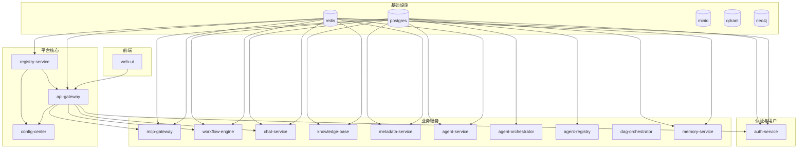
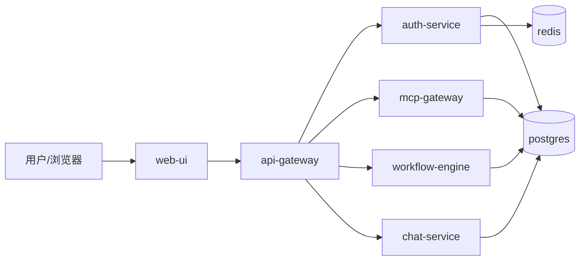

# 中化国际 AIOS 平台 - 模块功能、依赖关系与部署说明

## 一、各模块功能与依赖关系

### 1.1 基础设施层

| 模块 | 功能 | 端口 | 依赖 |
|------|------|------|------|
| **postgres** | PostgreSQL 主库，业务数据、用户、工作流、知识库等 | 5432 | 无 |
| **redis** | 缓存、会话、限流、服务发现 | 6379 | 无 |
| **minio** | 对象存储（文档、文件） | 9000/9001 | 无 |
| **qdrant** | 向量数据库（知识库/检索） | 6333 | 无 |
| **neo4j** | 图数据库（知识图谱等） | 7474/7687 | 无 |

### 1.2 平台核心层

| 模块 | 功能 | 端口 | 依赖 |
|------|------|------|------|
| **registry-service** | 服务注册与发现 | 8000 | redis |
| **config-center** | 配置中心 | 8090 | redis, registry-service |
| **api-gateway** | 统一 API 网关，路由/限流/熔断，转发到各业务服务 | 8080 | redis, registry-service |

### 1.3 认证与用户层

| 模块 | 功能 | 端口 | 依赖 |
|------|------|------|------|
| **auth-service** | 认证、登录/登出、JWT、用户与角色权限 | 8003 | postgres, redis |

### 1.4 业务服务层

| 模块 | 功能 | 端口 | 依赖 |
|------|------|------|------|
| **mcp-gateway** | MCP 工具网关，工具注册与调用 | 8001 | postgres, redis |
| **workflow-engine** | 工作流编排与执行 | 8002 | postgres, redis |
| **chat-service** | 对话、会话、消息 | 8006 | postgres, redis |
| **knowledge-base** | 知识库、文档解析、向量检索 | 8004 | postgres, redis |
| **metadata-service** | 元数据、实体映射、业务实体 | 8005 | postgres, redis |
| **agent-service** | 智能体服务 | 8010 | postgres, redis 等 |
| **agent-orchestrator** | 智能体编排 | 8011 | 下游服务 |
| **agent-registry** | 智能体注册 | 8012 | 下游服务 |
| **dag-orchestrator** | DAG 编排 | 8009 | 无（独立） |
| **memory-service** | 记忆/上下文服务 | 8013 | postgres, redis 等 |

### 1.5 前端与可选服务

| 模块 | 功能 | 端口 | 依赖 |
|------|------|------|------|
| **web-ui** | Next.js 前端（门户、聊天、工作流、管理后台等） | 3000 | 通过 API 访问 api-gateway 等 |
| **redis-commander** | Redis 管理界面（profile: optional） | 8081 | redis |
| **sap-mcp-server** | SAP MCP 服务（profile: sap） | 3001 | config-center |
| **joyagent-adapter** | JoyAgent 适配（profile: joyagent） | 3001/1601 | postgres, redis, registry-service |
| **project-management** | 项目管理（profile: optional） | - | postgres, redis 等 |
| **opencode** | OpenCode 开发环境（profile: optional） | 4096 | - |

---

## 二、依赖关系网络图（Mermaid）

以下为**服务级**依赖（depends_on / 实际调用关系），不含 profile 的可选服务已简化标注。

**数据流简图（用户请求方向）：**

---

## 三、部署文件与项目文件位置

### 3.1 部署到 Docker 中的项目与部署文件

| 类型 | 存储位置 | 说明 |
|------|----------|------|
| **编排与镜像定义** | 项目根目录 | |
| ├ 编排文件 | `docker-compose.yml` | 所有服务定义、网络、卷、依赖、环境变量 |
| ├ 环境变量模板 | `.env` | 端口、密码、功能开关等（不提交敏感值） |
| ├ 各服务 Dockerfile | 各服务目录下 `Dockerfile` 或 `Dockerfile.dev` | 构建镜像用 |
| **后端/共享代码（按服务挂载进容器）** | 项目根目录下各子目录 | |
| ├ 网关 | `api-gateway/` | 代码：`api-gateway/src`，构建上下文：`./api-gateway` |
| ├ 认证 | `auth-service/` | 代码：`auth-service/src`，构建上下文：`.`（根），挂载 `./database` |
| ├ 注册中心 | `registry-service/` | 代码：`registry-service/src` |
| ├ 配置中心 | `config-center/` | 代码：`config-center/src` |
| ├ MCP 网关 | `mcp-gateway/` | 构建上下文：`.`，挂载 `./database`、`./shared_libs` |
| ├ 工作流 | `workflow-engine/` | 构建上下文：`.`，挂载 `./database`、`./shared_libs` |
| ├ 对话 | `chat-service/` | 构建上下文：`.`，挂载 `./database`、`./shared_libs` |
| ├ 知识库 | `knowledge-base/` | 构建上下文：`.`，挂载 `./database`、`./shared_libs` |
| ├ 元数据 | `metadata-service/` | 构建上下文：`.`，挂载 `./database`、`./shared_libs` |
| ├ 智能体相关 | `agent-service/`、`agent-orchestrator/`、`agent-registry/`、`dag-orchestrator/`、`memory-service/` | 各自目录或根上下文，部分挂载 `./database` |
| **共享与数据** | | |
| ├ 数据库脚本与迁移 | `database/` | 初始化脚本：`database/init-scripts/`；Alembic：`database/src/migrations/` |
| ├ 共享库 | `shared_libs/` | 多服务共用 Python 包 |
| **前端（若用 Docker 跑 web-ui）** | `web-ui/` | 构建上下文：`./web-ui`，挂载 `./web-ui/src`、`./web-ui/public` 等 |
| **Docker 运行时数据（卷）** | Docker 管理 | `postgres_data`、`redis_data`、`minio_data`、`*_venv`、`web_ui_node_modules` 等，见 `docker-compose.yml` 中 `volumes:` |

总结：**Docker 部署**所用到的“项目文件”和“部署文件”都在**当前仓库根目录**下；镜像由各子目录（或根目录）的 Dockerfile 在 `docker-compose` 构建时生成，运行时通过 `volumes` 挂载源码/配置，无单独“部署目录”。

---

### 3.2 部署在 Node（宿主机）中的项目与部署文件（前端）

当前推荐方式：**前端在宿主机用 Node 运行，后端仍用 Docker**。

| 类型 | 存储位置 | 说明 |
|------|----------|------|
| **前端项目代码** | `web-ui/` | Next.js 应用，即“部署在 Node 中的项目文件” |
| ├ 页面与组件 | `web-ui/src/app/`、`web-ui/src/components/` 等 | 源码 |
| ├ 配置 | `web-ui/package.json`、`web-ui/next.config.js`、`web-ui/tsconfig.json` 等 | 构建与运行配置 |
| **前端环境与部署配置** | `web-ui/` 下 | 即“部署在 Node 中的部署文件” |
| ├ 环境变量 | `web-ui/.env.local` | 后端 API 地址（如 `NEXT_PUBLIC_*`、`API_GATEWAY_URL` 等），宿主机运行时使用 |
| ├ 依赖 | `web-ui/node_modules/` | 由 `npm install` 在宿主机生成，不提交 |
| ├ 构建产物 | `web-ui/.next/` | 由 `npm run build` 生成（生产时），不提交 |
| **启动方式** | 宿主机终端 | 在项目根目录执行：`cd web-ui && npm install --legacy-peer-deps && npm run dev`，无单独部署脚本目录 |

总结：**Node（宿主机）部署**的“项目文件”在 **`web-ui/`**；“部署文件”主要是 **`web-ui/.env.local`** 以及 `package.json`/`next.config.js` 等配置，均在同一 `web-ui/` 目录下，与仓库根目录为同一套代码，无单独“Node 部署目录”。

---

## 四、对照小结

| 部署方式 | 项目文件位置 | 部署文件位置 |
|----------|--------------|--------------|
| **Docker（后端 + 可选前端）** | 仓库根目录及各子目录（如 `api-gateway/`、`auth-service/`、`web-ui/`、`database/` 等） | 根目录 `docker-compose.yml`、`.env`；各服务目录下 `Dockerfile`/`Dockerfile.dev`；数据库相关在 `database/` |
| **Node 宿主机（仅前端）** | `web-ui/` | `web-ui/.env.local`、`web-ui/package.json` 等（同目录） |

依赖关系网络图见第二节 Mermaid 图；若需导出为图片，可使用支持 Mermaid 的 Markdown 预览或 [Mermaid Live Editor](https://mermaid.live)。
