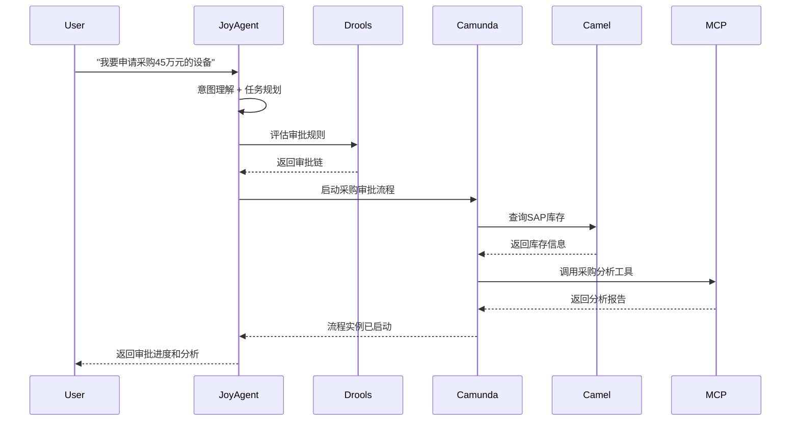
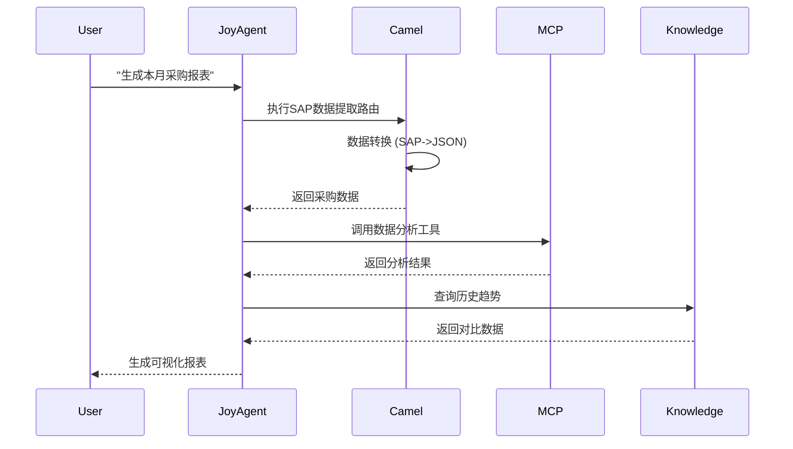

# LuminaOS企业级集成架构方案

## 📋 当前平台架构分析

### 现有服务清单（共11个服务）

#### 基础设施层
1. **postgres** (5432) - PostgreSQL数据库
2. **redis** (6379) - Redis缓存
3. **redis-commander** (8081) - Redis管理界面

#### 核心服务层
4. **registry-service** (8000) - 服务注册与发现中心 ✅ 已实现
5. **api-gateway** (8080) - 统一API网关 ✅ 已实现
6. **config-center** (8090) - 配置管理中心 ✅ 已实现

#### 业务服务层
7. **mcp-gateway** (8001) - MCP工具网关
8. **workflow-engine** (8002) - 工作流引擎
9. **auth-service** (8003) - 认证服务
10. **knowledge-base** (8004) - 知识库服务
11. **metadata-service** (8005) - 元数据服务
12. **chat-service** (8006) - 聊天服务

#### 前端层
13. **web-ui** (3000) - Next.js前端界面

### 现有架构优势
- ✅ 完整的微服务基础设施（注册中心、API网关、配置中心）
- ✅ 统一的技术栈（Python FastAPI）
- ✅ 完善的健康检查机制
- ✅ Docker容器化部署
- ✅ AI能力集成（MCP工具、工作流、知识库）

### 架构缺口分析
- ❌ 缺少企业级工作流引擎（Camunda）
- ❌ 缺少系统集成平台（Apache Camel）
- ❌ 缺少业务规则引擎（Drools）
- ❌ 缺少AI协调编排层（JoyAgent）
- ❌ 现有workflow-engine功能有限，不支持BPMN标准

## 🏗️ 企业级集成架构设计

### 整体架构图

```
┌─────────────────── LuminaOS 企业AI平台 ───────────────────┐
│                                                             │
│  ┌──────────── 用户交互层 ────────────┐                   │
│  │   Web UI (3000) - Next.js前端     │                   │
│  └──────────────────────────────────────┘                  │
│                     ↓                                       │
│  ┌──────────── API网关层 ───────────────┐                 │
│  │   API Gateway (8080)                 │                 │
│  │   - 路由转发                          │                 │
│  │   - 限流熔断                          │                 │
│  │   - 认证鉴权                          │                 │
│  └──────────────────────────────────────┘                  │
│                     ↓                                       │
│  ┌──────────── AI协调层 (新增) ─────────┐                 │
│  │   JoyAgent Service (8007)            │                 │
│  │   - 意图理解                          │                 │
│  │   - 任务规划                          │                 │
│  │   - 智能编排                          │                 │
│  └──────────────────────────────────────┘                  │
│            ↓              ↓              ↓                  │
│  ┌─────────────┬─────────────┬──────────────┐            │
│  │             │             │              │            │
│  │  ┌──────────▼─────────┐  │  ┌──────────▼──────────┐ │
│  │  │ Camunda (新增)     │  │  │ Drools (新增)       │ │
│  │  │ - BPMN工作流       │  │  │ - 业务规则引擎      │ │
│  │  │ - 流程编排         │  │  │ - 规则评估          │ │
│  │  │ Port: 8008         │  │  │ Port: 8010          │ │
│  │  └────────────────────┘  │  └─────────────────────┘ │
│  │                           │                           │
│  │  ┌──────────▼──────────────────────────────────┐    │
│  │  │ Apache Camel Service (新增)                 │    │
│  │  │ - 企业系统集成                               │    │
│  │  │ - 消息路由转换                               │    │
│  │  │ Port: 8009                                   │    │
│  │  └──────────────────────────────────────────────┘    │
│  │                           │                           │
│  └───────────────────────────┴────────────────────────┘  │
│                     ↓                                     │
│  ┌──────────── 现有业务服务层 ────────────┐              │
│  │  - MCP Gateway (8001)                  │              │
│  │  - Workflow Engine (8002)              │              │
│  │  - Auth Service (8003)                 │              │
│  │  - Knowledge Base (8004)               │              │
│  │  - Metadata Service (8005)             │              │
│  │  - Chat Service (8006)                 │              │
│  └────────────────────────────────────────┘              │
│                     ↓                                     │
│  ┌──────────── 基础设施层 ─────────────┐                 │
│  │  - Registry Service (8000)           │                │
│  │  - Config Center (8090)              │                │
│  │  - PostgreSQL (5432)                 │                │
│  │  - Redis (6379)                      │                │
│  └──────────────────────────────────────┘                │
│                                                            │
└────────────────────────────────────────────────────────────┘
```

### 服务端口分配

| 服务 | 端口 | 类型 | 状态 |
|-----|------|------|------|
| registry-service | 8000 | 基础设施 | ✅ 已存在 |
| mcp-gateway | 8001 | 业务服务 | ✅ 已存在 |
| workflow-engine | 8002 | 业务服务 | ✅ 已存在 |
| auth-service | 8003 | 业务服务 | ✅ 已存在 |
| knowledge-base | 8004 | 业务服务 | ✅ 已存在 |
| metadata-service | 8005 | 业务服务 | ✅ 已存在 |
| chat-service | 8006 | 业务服务 | ✅ 已存在 |
| **joyagent-service** | **8007** | **AI协调** | ⭕ 新增 |
| **camunda-service** | **8008** | **工作流** | ⭕ 新增 |
| **camel-service** | **8009** | **集成** | ⭕ 新增 |
| **drools-service** | **8010** | **规则** | ⭕ 新增 |
| api-gateway | 8080 | 基础设施 | ✅ 已存在 |
| **camunda-engine** | **8081** | **工作流引擎** | ⭕ 新增 |
| **drools-kieserver** | **8082** | **规则引擎** | ⭕ 新增 |
| config-center | 8090 | 基础设施 | ✅ 已存在 |
| web-ui | 3000 | 前端 | ✅ 已存在 |

## 🎯 新增服务详细设计

### 1. JoyAgent Service - AI协调师

#### 职责定位
- **意图理解**: 理解用户的业务请求
- **任务规划**: 将业务需求分解为可执行任务
- **智能编排**: 协调Camunda、Drools、Camel等服务完成任务
- **上下文管理**: 维护对话和任务执行上下文

#### 技术架构
```python
# 服务结构
joyagent-service/
├── src/
│   ├── main.py                 # FastAPI主应用
│   ├── config.py               # 配置管理
│   ├── models/
│   │   ├── task_plan.py       # 任务规划模型
│   │   ├── context.py         # 上下文模型
│   │   └── intent.py          # 意图模型
│   ├── services/
│   │   ├── intent_service.py   # 意图理解服务
│   │   ├── planning_service.py # 任务规划服务
│   │   ├── orchestrator.py    # 编排服务
│   │   └── context_manager.py # 上下文管理
│   ├── integrations/
│   │   ├── camunda_client.py  # Camunda客户端
│   │   ├── drools_client.py   # Drools客户端
│   │   ├── camel_client.py    # Camel客户端
│   │   └── mcp_client.py      # MCP网关客户端
│   └── routes/
│       ├── process.py         # 处理业务请求
│       ├── plans.py           # 任务规划管理
│       └── health.py          # 健康检查
├── requirements.txt
├── Dockerfile
└── README.md
```

#### 核心API
```
POST /api/joyagent/process          # 处理业务请求
GET  /api/joyagent/plans/{id}       # 获取任务规划
POST /api/joyagent/plans/{id}/execute # 执行任务规划
GET  /api/joyagent/context/{id}     # 获取执行上下文
```

### 2. Camunda Service - 企业工作流引擎

#### 职责定位
- **BPMN流程管理**: 支持标准BPMN 2.0规范
- **流程实例管理**: 启动、暂停、恢复、终止流程
- **任务管理**: 用户任务、服务任务的分配和执行
- **外部任务**: 集成MCP工具和其他服务

#### 技术架构
```python
# 服务结构
camunda-service/
├── src/
│   ├── main.py                    # FastAPI主应用
│   ├── config.py                  # 配置管理
│   ├── models/
│   │   ├── process.py            # 流程模型
│   │   ├── instance.py           # 流程实例模型
│   │   └── task.py               # 任务模型
│   ├── services/
│   │   ├── process_service.py    # 流程部署服务
│   │   ├── instance_service.py   # 流程实例服务
│   │   ├── task_service.py       # 任务管理服务
│   │   └── external_task_worker.py # 外部任务工作者
│   ├── integrations/
│   │   ├── camunda_engine.py     # Camunda引擎客户端
│   │   ├── mcp_integration.py    # MCP工具集成
│   │   └── metadata_integration.py # 元数据服务集成
│   └── routes/
│       ├── processes.py          # 流程管理
│       ├── instances.py          # 流程实例
│       ├── tasks.py              # 任务管理
│       └── health.py             # 健康检查
├── bpmn/                          # BPMN流程定义
│   ├── procurement_approval.bpmn # 采购审批流程
│   ├── leave_request.bpmn        # 请假流程
│   └── ...
├── requirements.txt
├── Dockerfile
└── README.md
```

#### 核心API
```
POST /api/camunda/processes/deploy     # 部署流程定义
POST /api/camunda/processes/{key}/start # 启动流程实例
GET  /api/camunda/instances/{id}       # 获取流程实例
POST /api/camunda/tasks/{id}/complete  # 完成任务
```

#### Camunda Engine配置
- 使用官方Docker镜像: `camunda/camunda-bpm-platform:latest`
- 数据库: PostgreSQL (复用现有postgres服务)
- REST API: `/engine-rest`
- Web界面: `/camunda` (Cockpit, Tasklist, Admin)

### 3. Apache Camel Service - 企业集成平台

#### 职责定位
- **系统集成**: 连接SAP、OA、ERP等企业系统
- **消息路由**: 实现复杂的消息路由逻辑
- **数据转换**: 不同系统间的数据格式转换
- **协议适配**: 支持HTTP、JMS、FTP、WebService等协议

#### 技术架构
```python
# 服务结构
camel-service/
├── src/
│   ├── main.py                    # FastAPI主应用
│   ├── config.py                  # 配置管理
│   ├── models/
│   │   ├── route.py              # 路由模型
│   │   ├── integration.py        # 集成配置模型
│   │   └── message.py            # 消息模型
│   ├── services/
│   │   ├── camel_context.py      # Camel上下文管理
│   │   ├── route_builder.py      # 路由构建器
│   │   └── integration_service.py # 集成服务
│   ├── routes/                    # Camel路由定义
│   │   ├── sap_routes.py         # SAP集成路由
│   │   ├── oa_routes.py          # OA系统路由
│   │   ├── erp_routes.py         # ERP系统路由
│   │   └── mcp_routes.py         # MCP工具路由
│   ├── transformers/              # 数据转换器
│   │   ├── xml_transformer.py
│   │   ├── json_transformer.py
│   │   └── csv_transformer.py
│   └── api/
│       ├── execute.py            # 执行集成路由
│       ├── routes.py             # 路由管理
│       └── health.py             # 健康检查
├── requirements.txt
├── Dockerfile
└── README.md
```

#### 核心API
```
POST /api/camel/execute/{route}    # 执行集成路由
GET  /api/camel/routes             # 获取所有路由
POST /api/camel/routes/create      # 创建新路由
GET  /api/camel/routes/{id}/status # 获取路由状态
```

#### 预定义路由
1. **SAP集成路由**: 物料查询、库存查询、订单创建
2. **OA系统路由**: 审批流程、公文流转
3. **ERP路由**: 财务数据同步、采购订单
4. **MCP工具路由**: 与MCP Gateway的标准化集成

### 4. Drools Service - 业务规则引擎

#### 职责定位
- **规则管理**: 定义和管理业务规则
- **规则执行**: 实时评估业务规则
- **决策支持**: 为业务流程提供决策依据
- **动态规则**: 支持运行时更新规则

#### 技术架构
```python
# 服务结构
drools-service/
├── src/
│   ├── main.py                    # FastAPI主应用
│   ├── config.py                  # 配置管理
│   ├── models/
│   │   ├── rule.py               # 规则模型
│   │   ├── fact.py               # 事实模型
│   │   └── decision.py           # 决策结果模型
│   ├── services/
│   │   ├── rule_service.py       # 规则管理服务
│   │   ├── evaluation_service.py # 规则评估服务
│   │   └── kie_client.py         # KIE Server客户端
│   ├── rules/                     # 规则定义
│   │   ├── procurement.drl       # 采购审批规则
│   │   ├── leave.drl             # 请假规则
│   │   ├── pricing.drl           # 定价规则
│   │   └── credit.drl            # 信用评估规则
│   └── routes/
│       ├── rules.py              # 规则管理
│       ├── evaluate.py           # 规则评估
│       ├── decisions.py          # 决策查询
│       └── health.py             # 健康检查
├── requirements.txt
├── Dockerfile
└── README.md
```

#### 核心API
```
POST /api/drools/evaluate          # 评估业务规则
POST /api/drools/rules/create      # 创建规则
GET  /api/drools/rules/{id}        # 获取规则定义
PUT  /api/drools/rules/{id}/update # 更新规则
```

#### Drools KIE Server配置
- 使用官方Docker镜像: `kiegroup/kie-server:latest`
- REST API: `/kie-server/services/rest/server`
- 规则格式: DRL (Drools Rule Language)

## 🔄 服务集成流程

### 业务场景1: 智能采购审批



### 业务场景2: 智能报表生成



## 🛠️ 实施计划

### Phase 1: 基础服务搭建 (Week 1-2)
1. ✅ 创建服务目录结构
2. ✅ 实现JoyAgent Service基础框架
3. ✅ 集成Camunda Engine
4. ✅ 集成Drools KIE Server
5. ✅ 实现Apache Camel Service基础框架

### Phase 2: 服务集成 (Week 3-4)
1. ✅ JoyAgent与现有服务集成（MCP、Workflow、Metadata）
2. ✅ Camunda外部任务worker实现
3. ✅ Camel路由配置（SAP、OA、MCP）
4. ✅ Drools规则定义（采购、审批、定价）

### Phase 3: 业务场景实现 (Week 5-6)
1. ✅ 实现智能采购审批流程
2. ✅ 实现智能报表生成
3. ✅ 实现请假审批流程
4. ✅ 实现动态定价规则

### Phase 4: 测试和优化 (Week 7-8)
1. ✅ 单元测试
2. ✅ 集成测试
3. ✅ 性能测试
4. ✅ 文档完善

## 📊 技术栈对比

### JoyAgent vs 现有Workflow Engine

| 维度 | 现有Workflow Engine | JoyAgent集成方案 |
|-----|---------------------|------------------|
| AI能力 | 基础LLM调用 | 高级意图理解、任务规划 |
| 流程标准 | 自定义格式 | BPMN 2.0标准 |
| 规则引擎 | 无 | Drools规则引擎 |
| 系统集成 | 有限 | Apache Camel全面集成 |
| 可视化 | 基础 | Camunda专业流程设计器 |
| 企业级特性 | 有限 | 完整企业级特性 |

### 集成优势
- **技术成熟度**: Camunda、Drools、Camel都是经过验证的企业级产品
- **标准化**: 支持BPMN、DMN等国际标准
- **可扩展性**: 易于扩展新的业务场景
- **运维友好**: 完善的监控、日志、调试工具
- **社区支持**: 活跃的开源社区和丰富的文档

## 🔐 安全考虑

### 认证授权
- 所有新服务通过API Gateway统一认证
- 使用现有Auth Service进行用户认证
- 服务间通信使用JWT Token

### 数据安全
- 敏感数据加密存储
- 审计日志记录所有关键操作
- 规则和流程定义版本控制

### 网络安全
- 服务间通信限制在内部网络
- 外部系统集成使用VPN或专线
- API限流防止恶意攻击

## 📈 监控和运维

### 监控指标
- JoyAgent: 任务规划成功率、平均响应时间
- Camunda: 流程实例数、活动任务数、平均完成时间
- Camel: 路由吞吐量、失败率、重试次数
- Drools: 规则评估次数、执行时间

### 日志管理
- 统一日志格式
- 集中日志收集（考虑ELK Stack）
- 关键事件告警

### 性能优化
- Camunda流程实例缓存
- Drools规则缓存
- Camel路由池化

## 🚀 部署策略

### Docker Compose部署
- 开发环境: docker-compose.yml
- 生产环境: docker-compose.prod.yml

### 镜像构建
- 统一基础镜像
- 多阶段构建优化镜像大小
- 镜像缓存加速构建

### 滚动更新
- 零停机部署
- 健康检查确保服务可用
- 快速回滚机制

## 📚 文档和培训

### 开发文档
- API文档 (Swagger/OpenAPI)
- 集成指南
- 最佳实践

### 运维文档
- 部署手册
- 故障排查指南
- 监控配置

### 用户文档
- 业务场景指南
- 规则配置指南
- 流程设计指南

---

*文档版本: 1.0*
*创建时间: 2025-11-17*
*作者: AI Architecture Team*
