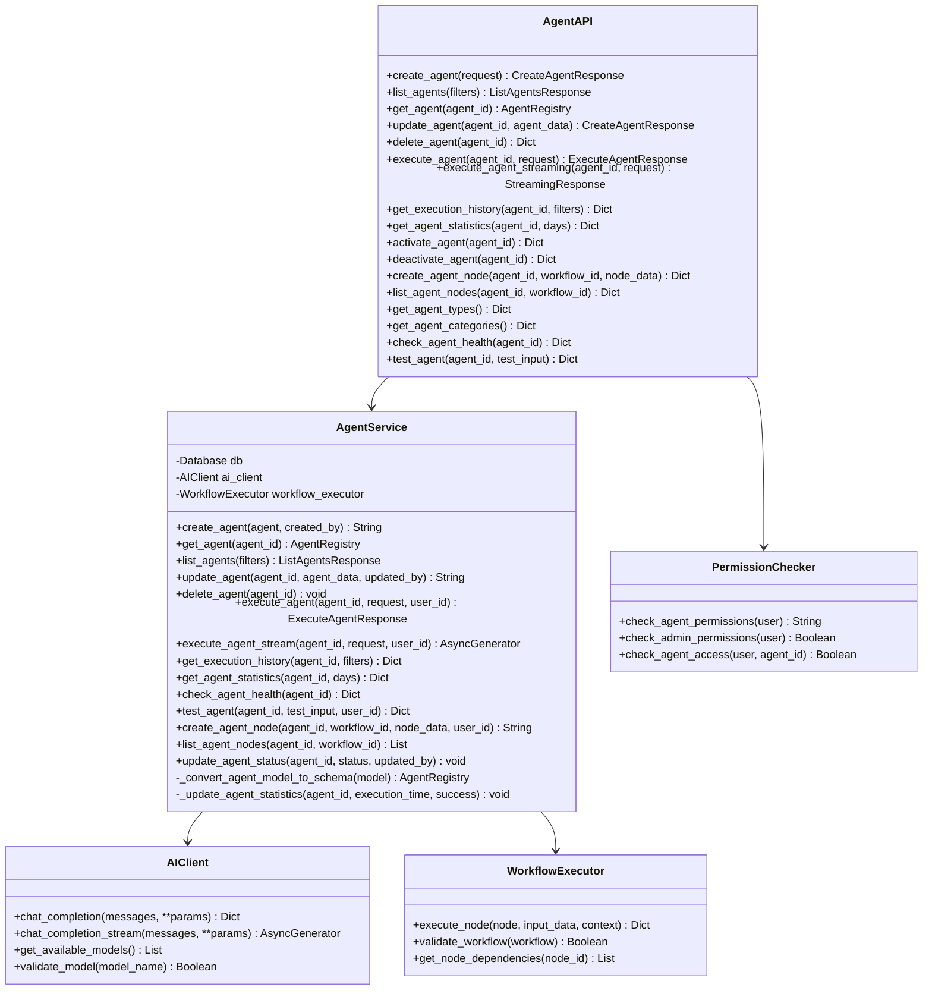
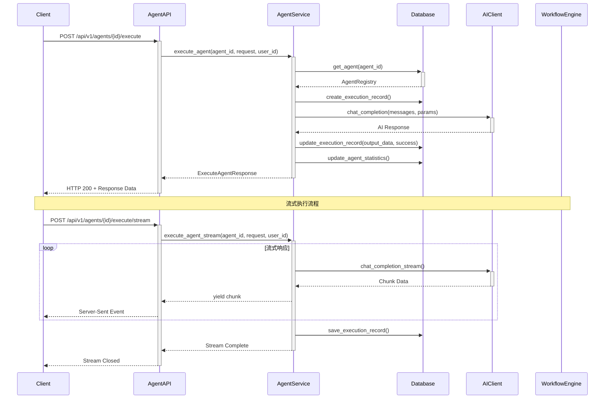
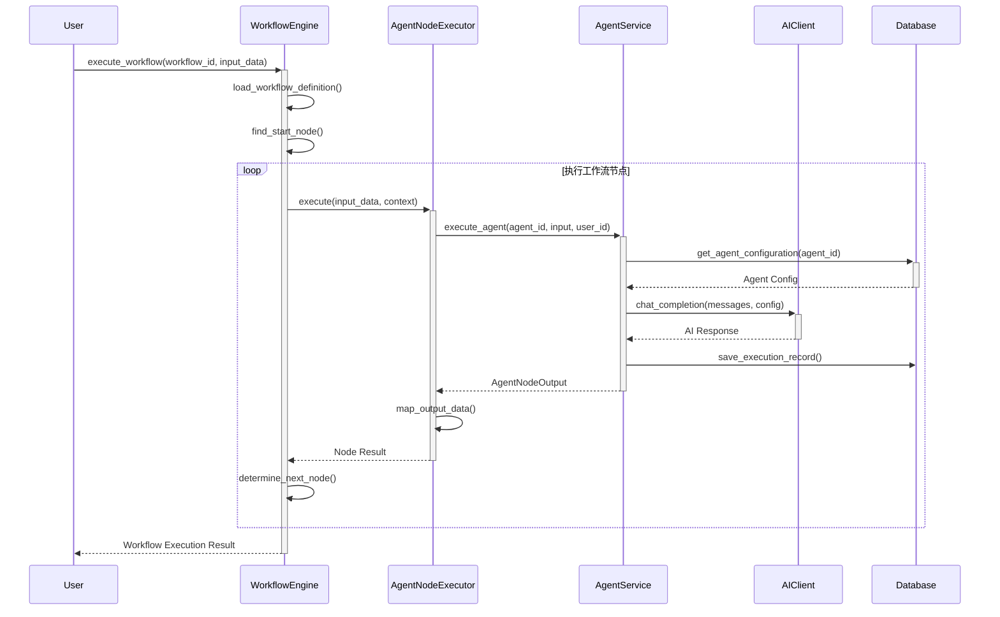
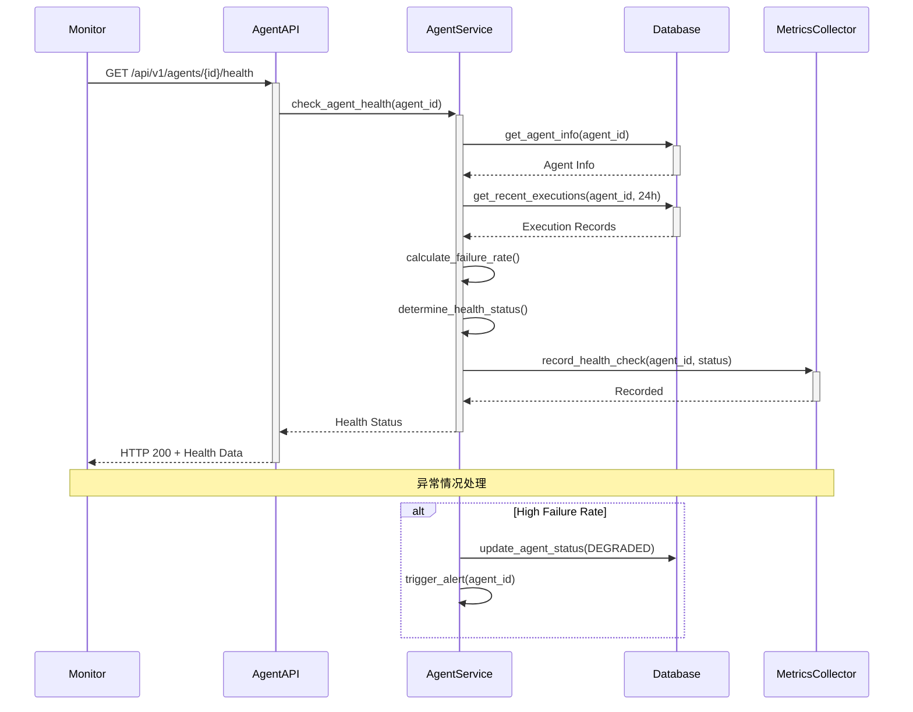

# 智能体节点架构 - 类图和序列图

## 1. 智能体核心架构类图

```mermaid
classDiagram
    class AgentType {
        <<enumeration>>
        CONVERSATIONAL
        TOOL_CALLING
        REASONING
        PLANNING
        CODE_GENERATION
        DATA_ANALYSIS
        DOCUMENT_PROCESSING
    }

    class AgentStatus {
        <<enumeration>>
        ACTIVE
        INACTIVE
        TRAINING
        DEPRECATED
        FAILED
    }

    class AgentExecutionState {
        <<enumeration>>
        PENDING
        RUNNING
        THINKING
        CALLING_TOOLS
        WAITING_FOR_INPUT
        COMPLETED
        FAILED
        TIMEOUT
        CANCELLED
    }

    class AgentPersonality {
        +String name
        +String description
        +List~String~ traits
        +String communication_style
        +List~String~ expertise_areas
        +List~String~ limitations
    }

    class AgentCapability {
        +String name
        +String description
        +Dict input_schema
        +Dict output_schema
        +List~String~ required_tools
        +List~Dict~ examples
    }

    class AgentConfiguration {
        +String model
        +Float temperature
        +Integer max_tokens
        +Float top_p
        +Float frequency_penalty
        +Float presence_penalty
        +Integer timeout
        +Integer max_tool_calls
        +Boolean enable_memory
        +Integer memory_size
    }

    class AgentRegistry {
        +String id
        +String name
        +String display_name
        +String description
        +AgentType agent_type
        +AgentStatus status
        +String version
        +AgentPersonality personality
        +List~AgentCapability~ capabilities
        +AgentConfiguration configuration
        +String system_prompt
        +String user_prompt_template
        +List~String~ available_tools
        +List~String~ required_permissions
        +List~String~ tags
        +String category
        +String author
        +String created_by
        +DateTime created_at
        +DateTime updated_at
        +DateTime published_at
        +Integer usage_count
        +Float success_rate
        +Float average_execution_time
    }

    class AgentNode {
        +String id
        +String workflow_id
        +String agent_id
        +String node_name
        +String description
        +Dict position
        +Dict size
        +Dict style
        +Dict input_mapping
        +Dict output_mapping
        +Integer retry_count
        +Integer retry_delay
        +Boolean enable_streaming
        +Integer context_window_size
        +Boolean preserve_conversation
        +DateTime created_at
        +DateTime updated_at
    }

    class AgentNodeInput {
        +String content
        +Dict context
        +Dict variables
        +String conversation_id
        +String user_id
        +Dict metadata
    }

    class AgentNodeOutput {
        +String content
        +Dict metadata
        +List~Dict~ tool_calls
        +List~String~ reasoning_steps
        +Float confidence_score
        +Float execution_time
        +Integer tokens_used
    }

    class AgentContext {
        +String conversation_id
        +String agent_id
        +String node_id
        +List~ConversationMessage~ messages
        +AgentExecutionState current_state
        +Dict variables
        +Dict shared_memory
        +Integer execution_count
        +Integer total_tokens
        +Float total_execution_time
        +DateTime created_at
        +DateTime updated_at
        +DateTime expires_at
    }

    class ConversationMessage {
        +String id
        +ConversationRole role
        +String content
        +List~Dict~ tool_calls
        +Dict metadata
        +DateTime timestamp
    }

    class AgentExecutionRecord {
        +String id
        +String agent_id
        +String node_id
        +String workflow_id
        +String execution_id
        +AgentNodeInput input_data
        +AgentNodeOutput output_data
        +AgentExecutionState state
        +String error_message
        +String error_code
        +DateTime start_time
        +DateTime end_time
        +Float execution_time
        +Integer tokens_used
        +Integer tool_calls_count
        +Boolean success
        +Float quality_score
        +String user_feedback
        +Dict metadata
    }

    AgentRegistry ||--|| AgentPersonality
    AgentRegistry ||--|| AgentConfiguration
    AgentRegistry ||--o{ AgentCapability
    AgentRegistry ||--o{ AgentNode
    AgentRegistry ||--o{ AgentContext
    AgentRegistry ||--o{ AgentExecutionRecord

    AgentNode ||--o{ AgentContext
    AgentNode ||--o{ AgentExecutionRecord

    AgentContext ||--o{ ConversationMessage

    AgentExecutionRecord ||--|| AgentNodeInput
    AgentExecutionRecord ||--o| AgentNodeOutput
```

## 2. 智能体服务架构类图



## 3. 工作流集成架构类图

```mermaid
classDiagram
    class WorkflowEngine {
        +execute_workflow(workflow_id, input_data) Dict
        +execute_node(node_id, input_data, context) Dict
        +get_workflow_definition(workflow_id) WorkflowDefinition
        +validate_workflow(workflow) Boolean
    }

    class WorkflowDefinition {
        +String id
        +String name
        +String description
        +List~WorkflowNode~ nodes
        +List~WorkflowConnection~ connections
        +String start_node_id
        +WorkflowStatus status
        +String version
        +Dict metadata
        +DateTime created_at
        +DateTime updated_at
    }

    class WorkflowNode {
        +String id
        +String name
        +NodeType node_type
        +Dict configuration
        +List~String~ input_ports
        +List~String~ output_ports
        +Dict position
        +Dict metadata
    }

    class AgentWorkflowNode {
        +String agent_id
        +Dict agent_configuration
        +Dict input_mapping
        +Dict output_mapping
        +Boolean enable_streaming
        +Integer retry_count
        +Integer retry_delay
        +execute(input_data, context) AgentNodeOutput
        +validate_configuration() Boolean
        +get_agent_info() AgentRegistry
    }

    class NodeExecutor {
        <<interface>>
        +execute(input_data, context) Dict
        +validate_configuration() Boolean
    }

    class AgentNodeExecutor {
        -AgentService agent_service
        +execute(input_data, context) Dict
        +validate_configuration() Boolean
        +handle_agent_execution(agent_id, input) AgentNodeOutput
        +handle_streaming_execution(agent_id, input) AsyncGenerator
    }

    WorkflowEngine --> WorkflowDefinition
    WorkflowDefinition ||--o{ WorkflowNode
    WorkflowNode <|-- AgentWorkflowNode
    NodeExecutor <|-- AgentNodeExecutor
    AgentNodeExecutor --> AgentService
    AgentWorkflowNode --> AgentNodeExecutor
```

## 4. 智能体执行序列图



## 5. 智能体创建和管理序列图

```mermaid
sequenceDiagram
    participant Admin
    participant AgentAPI
    participant AgentService
    participant Database
    participant ValidationService

    Admin->>+AgentAPI: POST /api/v1/agents (CreateAgentRequest)
    AgentAPI->>AgentAPI: check_agent_permissions(admin)

    AgentAPI->>+AgentService: create_agent(agent_data, created_by)
    AgentService->>+ValidationService: validate_agent_configuration(agent)
    ValidationService-->>-AgentService: Validation Result

    alt Validation Success
        AgentService->>+Database: check_name_uniqueness(agent.name)
        Database-->>-AgentService: Uniqueness Check

        alt Name Available
            AgentService->>Database: insert_agent_registry(agent_model)
            Database-->>AgentService: Success
            AgentService-->>-AgentAPI: agent_id
            AgentAPI-->>-Admin: CreateAgentResponse(success=True)
        else Name Taken
            AgentService-->>-AgentAPI: ValueError("名称已存在")
            AgentAPI-->>-Admin: HTTP 400 Error
        end
    else Validation Failed
        AgentService-->>-AgentAPI: ValidationError
        AgentAPI-->>-Admin: HTTP 400 Error
    end
```

## 6. 工作流中智能体节点执行序列图



## 7. 智能体健康监控序列图



## 8. 智能体对话上下文管理序列图

```mermaid
sequenceDiagram
    participant User
    participant AgentAPI
    participant AgentService
    participant ContextManager
    participant Database

    User->>+AgentAPI: execute_agent(with context)
    AgentAPI->>+AgentService: execute_agent(agent_id, request, user_id)

    AgentService->>+ContextManager: get_or_create_context(conversation_id, agent_id)
    ContextManager->>+Database: get_agent_context(conversation_id, agent_id)

    alt Context Exists
        Database-->>-ContextManager: Existing Context
        ContextManager->>Database: get_conversation_messages(context_id)
        Database-->>ContextManager: Message History
    else Context Not Exists
        Database-->>-ContextManager: null
        ContextManager->>Database: create_agent_context(conversation_id, agent_id)
        Database-->>ContextManager: New Context
    end

    ContextManager-->>-AgentService: Agent Context

    AgentService->>AgentService: build_context_messages()
    AgentService->>AgentService: execute_with_context()

    AgentService->>+ContextManager: update_context(context_id, new_message, variables)
    ContextManager->>Database: save_conversation_message()
    ContextManager->>Database: update_context_variables()
    ContextManager-->>-AgentService: Updated Context

    AgentService-->>-AgentAPI: Execution Result
    AgentAPI-->>-User: Response with Context
```