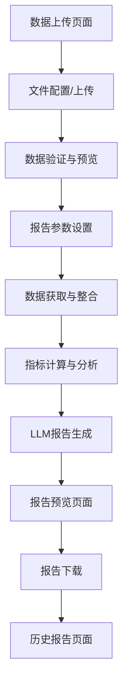

## 1. 产品概述
行业产品报告自动化生成本地Web应用，通过整合本地价格文件和卓创网数据，自动生成包含价格分析、供需预警、成本利润计算的专业报告。主要解决采购部门手动整理数据、制作报告效率低的问题，提升数据分析准确性和报告生成速度。

## 2. 核心功能

### 2.1 用户角色
| 角色 | 注册方式 | 核心权限 |
|------|----------|----------|
| 采购专员 | 本地系统账号 | 上传数据文件、生成报告、查看历史报告 |
| 部门主管 | 管理员分配 | 生成报告、下载报告、数据质量审核 |
| 系统管理员 | 本地管理员账号 | 系统配置、用户管理、数据源配置 |

### 2.2 功能模块
本应用包含以下核心页面：
1. **数据上传页面**：文件路径配置、数据文件上传、数据预览。
2. **报告生成页面**：参数设置、报告生成进度、报告预览。
3. **历史报告页面**：报告列表、报告详情查看、报告下载。

### 2.3 页面详情
| 页面名称 | 模块名称 | 功能描述 |
|----------|----------|----------|
| 数据上传页面 | 文件路径配置 | 设置三个数据文件路径（市场价格、销售价格、采购价格），支持本地文件选择 |
| 数据上传页面 | 数据文件上传 | 拖拽或选择Excel/CSV文件，支持文件格式验证和大小检查 |
| 数据上传页面 | 数据预览 | 展示上传文件的数据结构，包含商品名称、规格、产地、价格等字段 |
| 报告生成页面 | 参数设置 | 设置报告周期、选择分析商品范围、配置卓创网数据源 |
| 报告生成页面 | 报告生成进度 | 实时显示数据读取、指标计算、报告生成的进度状态 |
| 报告生成页面 | 报告预览 | 展示生成的HTML报告，包含价格速览表、供需图表、成本利润分析 |
| 历史报告页面 | 报告列表 | 按时间倒序展示历史生成的报告，支持按日期和商品筛选 |
| 历史报告页面 | 报告详情查看 | 查看完整报告内容，支持图表交互和趋势分析 |
| 历史报告页面 | 报告下载 | 下载HTML、PDF、Word格式的报告文件 |

## 3. 核心流程

### 数据上传与报告生成流程
1. 用户进入数据上传页面，配置文件路径或上传数据文件
2. 系统自动读取并验证数据格式，展示数据预览
3. 用户设置报告参数（分析周期、商品范围等）
4. 系统调用卓创网API获取补充数据（支持重试机制）
5. 执行数据清洗和异常检测，标记异常数据
6. 计算核心指标：供需平衡、成本利润、价格趋势
7. 调用Qwen2.5大语言模型生成分析报告
8. 生成包含ECharts图表的交互式HTML报告
9. 提供PDF和Word格式下载选项

## 4. 用户界面设计

### 4.1 设计风格
- **主色调**：深蓝色 (#1e40af) 作为主色，灰色 (#6b7280) 作为辅助色
- **按钮样式**：圆角矩形设计，主要操作为实心按钮，次要操作为边框按钮
- **字体**：系统默认字体，标题16px，正文14px，小字12px
- **布局风格**：卡片式布局，左侧导航栏，右侧内容区域
- **图标风格**：使用简洁的线性图标，保持视觉一致性

### 4.2 页面设计概述
| 页面名称 | 模块名称 | UI元素 |
|----------|----------|--------|
| 数据上传页面 | 文件路径配置 | 文件选择输入框，支持拖拽区域，文件路径显示，格式提示信息 |
| 数据上传页面 | 数据预览 | 表格展示数据结构，列包含商品名称、规格、产地、价格，支持排序和筛选 |
| 报告生成页面 | 参数设置 | 日期选择器，商品多选框，数据源配置下拉框，生成按钮 |
| 报告生成页面 | 进度显示 | 进度条，状态文字说明，预计剩余时间 |
| 报告预览页面 | 报告内容 | 封面信息区域，价格速览表格，ECharts图表区域，趋势分析卡片 |
| 历史报告页面 | 报告列表 | 表格展示报告列表，包含生成时间、分析周期、商品数量，操作列包含查看和下载按钮 |

### 4.3 响应式设计
- 采用桌面优先设计，支持1920x1080标准分辨率
- 适配1366x768及以上分辨率，保持核心功能完整显示
- 支持平板端横屏模式，优化触摸操作体验

### 4.4 图表设计规范
- **价格速览表**：支持按品种、涨跌幅度排序，涨跌值使用红绿颜色区分
- **供需与库存图表**：双轴组合图，柱状图显示库存量，折线图显示需求比
- **成本利润瀑布图**：展示单吨成本构成，使用不同颜色区分各项成本
- **趋势预测卡片**：每个品种独立卡片，包含价格走势图和预测结论