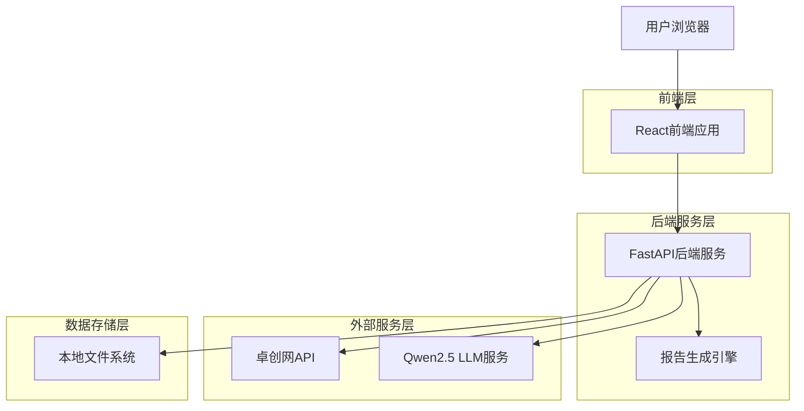
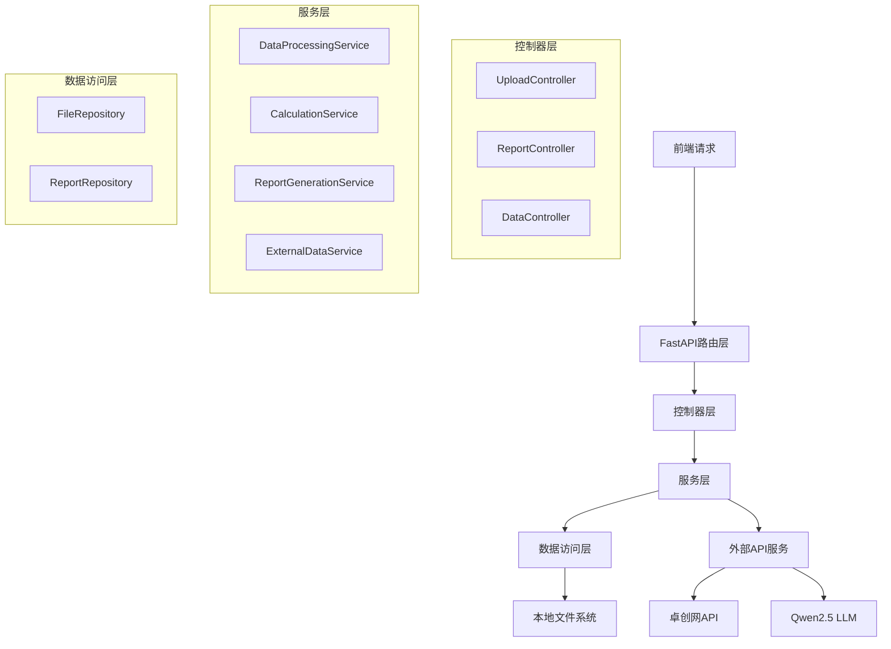
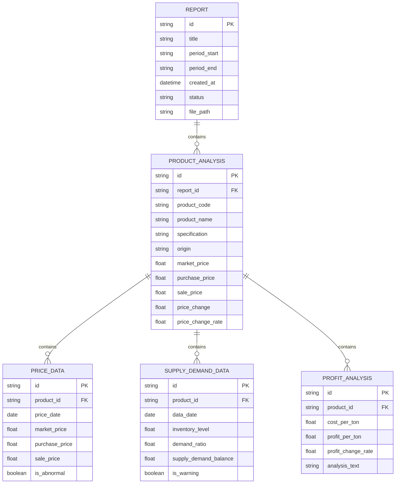

## 1. 架构设计



## 2. 技术描述

* **前端**: React\@18 + TypeScript + TailwindCSS\@3 + Vite

* **初始化工具**: vite-init

* **后端**: Python\@3.11 + FastAPI\@0.104 + Pandas\@2.0

* **报告生成**: ReportLab(PDF) + python-docx(Word) + Jinja2(HTML)

* **图表库**: ECharts\@5.4 + echarts-for-react

* **数据处理**: Pandas\@2.0 + NumPy\@1.24

* **文件处理**: openpyxl\@3.1 + python-multipart

* **HTTP客户端**: aiohttp\@3.9

## 3. 路由定义

| 路由                        | 用途                         |
| ------------------------- | -------------------------- |
| /                         | 主页，重定向到数据上传页面              |
| /upload                   | 数据上传页面，配置文件路径和上传数据文件       |
| /generate                 | 报告生成页面，设置参数并生成报告           |
| /reports                  | 历史报告页面，查看和管理生成的报告          |
| /report/:id               | 报告详情页面，查看具体报告内容和图表         |
| /api/upload               | 文件上传API端点                  |
| /api/generate             | 报告生成API端点                  |
| /api/reports              | 报告列表API端点                  |
| /api/report/:id           | 具体报告数据API端点                |
| /api/download/:id/:format | 报告下载API端点（支持HTML/PDF/Word） |

## 4. API定义

### 4.1 文件上传API

```
POST /api/upload
```

请求参数:

| 参数名  | 参数类型   | 是否必需 | 描述                                             |
| ---- | ------ | ---- | ---------------------------------------------- |
| file | File   | 是    | 上传的Excel或CSV文件                                 |
| type | string | 是    | 文件类型：market\_price/sale\_price/purchase\_price |

响应:

| 参数名     | 参数类型    | 描述        |
| ------- | ------- | --------- |
| success | boolean | 上传状态      |
| data    | object  | 文件信息和预览数据 |
| message | string  | 状态说明      |

### 4.2 报告生成API

```
POST /api/generate
```

请求参数:

| 参数名               | 参数类型    | 是否必需 | 描述                   |
| ----------------- | ------- | ---- | -------------------- |
| period\_start     | string  | 是    | 分析周期开始日期（YYYY-MM-DD） |
| period\_end       | string  | 是    | 分析周期结束日期（YYYY-MM-DD） |
| products          | array   | 是    | 分析商品代码列表             |
| include\_forecast | boolean | 否    | 是否包含价格预测，默认true      |

响应:

| 参数名        | 参数类型    | 描述          |
| ---------- | ------- | ----------- |
| success    | boolean | 生成状态        |
| report\_id | string  | 报告唯一标识      |
| progress   | number  | 生成进度（0-100） |
| message    | string  | 状态说明        |

### 4.3 报告查询API

```
GET /api/reports
```

查询参数:

| 参数名         | 参数类型   | 是否必需 | 描述        |
| ----------- | ------ | ---- | --------- |
| page        | number | 否    | 页码，默认1    |
| limit       | number | 否    | 每页数量，默认20 |
| start\_date | string | 否    | 开始日期筛选    |
| end\_date   | string | 否    | 结束日期筛选    |

## 5. 服务器架构图



## 6. 数据模型

### 6.1 数据模型定义



### 6.2 数据定义语言

报告表 (reports)

```sql
CREATE TABLE reports (
    id VARCHAR(50) PRIMARY KEY,
    title VARCHAR(200) NOT NULL,
    period_start DATE NOT NULL,
    period_end DATE NOT NULL,
    created_at TIMESTAMP DEFAULT CURRENT_TIMESTAMP,
    status VARCHAR(20) DEFAULT 'pending',
    file_path VARCHAR(500),
    html_content TEXT,
    pdf_path VARCHAR(500),
    word_path VARCHAR(500)
);
```

商品价格数据表 (price\_data)

```sql
CREATE TABLE price_data (
    id VARCHAR(50) PRIMARY KEY,
    product_code VARCHAR(50) NOT NULL,
    product_name VARCHAR(100) NOT NULL,
    specification VARCHAR(100),
    origin VARCHAR(100),
    price_date DATE NOT NULL,
    market_price DECIMAL(10,2),
    purchase_price DECIMAL(10,2),
    sale_price DECIMAL(10,2),
    price_change DECIMAL(10,2),
    price_change_rate DECIMAL(5,2),
    is_abnormal BOOLEAN DEFAULT FALSE,
    created_at TIMESTAMP DEFAULT CURRENT_TIMESTAMP
);

CREATE INDEX idx_price_data_product_date ON price_data(product_code, price_date);
```

供需数据表 (supply\_demand\_data)

```sql
CREATE TABLE supply_demand_data (
    id VARCHAR(50) PRIMARY KEY,
    product_code VARCHAR(50) NOT NULL,
    data_date DATE NOT NULL,
    inventory_level DECIMAL(10,2),
    demand_ratio DECIMAL(5,2),
    supply_demand_balance DECIMAL(10,2),
    is_warning BOOLEAN DEFAULT FALSE,
    forecast_trend VARCHAR(20),
    forecast_confidence DECIMAL(5,2),
    created_at TIMESTAMP DEFAULT CURRENT_TIMESTAMP
);
```

