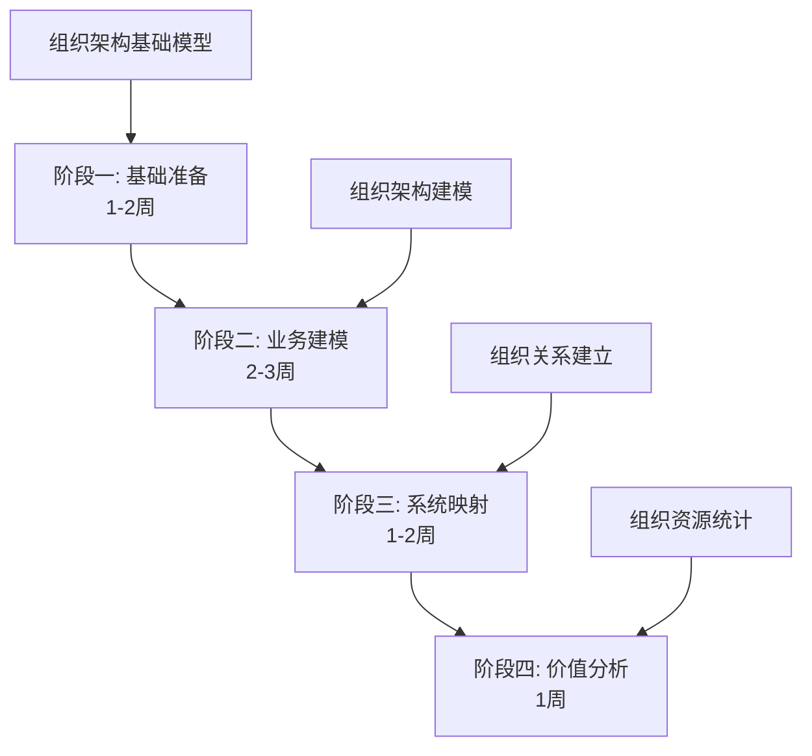

# 企业架构完整分析报告

## 第四部分：实施路径与计划

**报告日期**: 2025-12-07  
**承接**: 第三部分实施可行性分析

---

## 📋 第四部分概述

本部分提供详细的实施阶段划分、优先级排序、关键成功因素和时间估算。

---

## 🛣️ 一、实施阶段划分

### 1.1 第一阶段：基础准备（1-2周）

#### 1.1.1 目标

建立基础数据模型和Neo4j图模型，为后续实施奠定基础。

#### 1.1.2 任务清单

```yaml
数据模型层:
  - [ ] 新增AIPlatform和AIService模型
  - [ ] 新增OrganizationUnit和BusinessRole模型 ⭐
  - [ ] 增强BusinessProcess模型（痛点、关键性）
  - [ ] 创建数据库迁移脚本
  - [ ] 测试模型创建和查询

Neo4j图模型层:
  - [ ] 实现节点创建方法
  - [ ] 实现关系创建方法
  - [ ] 实现组织节点和关系创建 ⭐
  - [ ] 创建必要的索引
  - [ ] 测试Neo4j集成

交付物:
  - 数据库迁移脚本
  - Neo4j节点和关系创建服务
  - 单元测试（通过率>90%）

成功标准:
  - 所有模型可以正常创建
  - Neo4j节点和关系可以正常创建
  - 单元测试通过率>90%
```

#### 1.1.3 时间估算

- **数据模型层**: 4天
- **Neo4j图模型层**: 5.5天
- **测试和文档**: 1.5天
- **总计**: 11天（约2周）

### 1.2 第二阶段：业务建模（2-3周）

#### 1.2.1 目标

建立企业业务架构模型，包括业务流程、业务能力、组织架构。

#### 1.2.2 任务清单

```yaml
业务数据收集:
  - [ ] 梳理核心业务流程（>20个）
  - [ ] 识别业务能力（>5个）
  - [ ] 收集业务痛点（>30个）
  - [ ] 关联SAP模块
  - [ ] 梳理组织架构 ⭐
  - [ ] 收集组织与业务的关系 ⭐

业务建模服务:
  - [ ] 实现业务能力创建服务
  - [ ] 实现业务流程创建服务
  - [ ] 实现业务到系统映射服务
  - [ ] 实现痛点到AI服务映射服务
  - [ ] 实现组织架构服务 ⭐
  - [ ] 实现组织关系创建服务 ⭐

数据导入:
  - [ ] 实现Excel导入功能
  - [ ] 实现数据验证功能
  - [ ] 实现数据质量检查
  - [ ] 实现组织架构导入 ⭐

交付物:
  - 业务架构数据
  - 业务建模服务
  - 数据导入工具
  - 组织架构数据 ⭐

成功标准:
  - 核心业务流程已建模（>20个）
  - 业务能力已建模（>5个）
  - 业务痛点已记录（>30个）
  - 组织单元已建模（>10个）⭐
  - 组织-业务关系已建立（>20个）⭐
  - 数据质量评分>80%
```

#### 1.2.3 时间估算

- **业务数据收集**: 5-7天
- **业务建模服务**: 4天
- **数据导入工具**: 3天
- **组织架构建模**: 2-3天 ⭐
- **测试和验证**: 2天
- **总计**: 16-19天（约2-3周）

### 1.3 第三阶段：系统映射（1-2周）

#### 1.3.1 目标

建立业务到系统的映射关系，包括应用系统和AI平台。

#### 1.3.2 任务清单

```yaml
系统数据收集:
  - [ ] 梳理应用系统清单
  - [ ] 收集系统信息
  - [ ] 分析系统支撑的业务
  - [ ] 收集组织与系统的关系 ⭐

系统映射服务:
  - [ ] 实现业务到系统映射
  - [ ] 实现系统支撑关系创建
  - [ ] 实现支撑程度量化
  - [ ] 实现组织使用系统关系 ⭐

平台节点创建:
  - [ ] 创建AIPlatform节点
  - [ ] 创建AIService节点
  - [ ] 创建平台增强关系
  - [ ] 创建组织使用AI服务关系 ⭐

交付物:
  - 系统架构数据
  - 业务-系统映射关系
  - 平台增强关系
  - 组织-系统关系 ⭐

成功标准:
  - 所有核心系统已建模
  - 业务-系统映射覆盖率>80%
  - 组织-系统关系覆盖率>70% ⭐
  - 平台增强关系已建立
```

#### 1.3.3 时间估算

- **系统数据收集**: 3-4天
- **系统映射服务**: 3天
- **平台节点创建**: 2天
- **组织关系创建**: 1-2天 ⭐
- **测试和验证**: 1天
- **总计**: 10-12天（约1-2周）

### 1.4 第四阶段：价值分析（1周）

#### 1.4.1 目标

实现业务价值分析功能，包括影响分析、改进机会发现。

#### 1.4.2 任务清单

```yaml
分析服务:
  - [ ] 实现业务价值分析服务
  - [ ] 实现影响分析服务
  - [ ] 实现改进机会发现服务
  - [ ] 实现组织资源统计服务 ⭐
  - [ ] 实现组织变革影响分析服务 ⭐

API接口:
  - [ ] 创建业务价值分析API
  - [ ] 创建影响分析API
  - [ ] 创建查询API
  - [ ] 创建组织架构查询API ⭐

前端展示:
  - [ ] 创建业务价值仪表板
  - [ ] 创建影响分析可视化
  - [ ] 创建查询界面
  - [ ] 创建组织架构可视化 ⭐

交付物:
  - 价值分析服务
  - API接口
  - 前端展示页面

成功标准:
  - 可以回答7个核心业务问题（包括组织架构问题）⭐
  - API响应时间<2秒
  - 前端页面可用
```

#### 1.4.3 时间估算

- **分析服务**: 3天
- **API接口**: 1.5天
- **前端展示**: 2.5天
- **测试和优化**: 1天
- **总计**: 8天（约1周）

---

## 📊 二、实施优先级

### 2.1 优先级排序

#### 2.1.1 P0（必须实现）

```yaml
必须实现:
  1. 数据模型增强
     - AIPlatform和AIService模型
     - BusinessProcess增强（痛点、关键性）
     - OrganizationUnit模型 ⭐
     - 基础关系创建
  
  2. Neo4j图模型
     - 节点创建
     - 关系创建
     - 组织节点和关系创建 ⭐
     - 基础查询
  
  3. 业务建模服务
     - 业务能力创建
     - 业务流程创建
     - 业务到系统映射
     - 组织架构服务 ⭐
  
  理由: 这是方案的核心基础，必须首先实现
```

#### 2.1.2 P1（重要功能）

```yaml
重要功能:
  1. 痛点到AI服务映射
     - 自动识别改进机会
     - 创建AI服务节点
     - 建立增强关系
  
  2. 价值分析服务
     - 业务价值分析
     - 影响分析
     - 改进机会发现
     - 组织资源统计 ⭐
  
  3. 数据导入工具
     - Excel导入
     - 数据验证
     - 批量导入
     - 组织架构导入 ⭐
  
  理由: 这些功能提供核心价值，应该优先实现
```

#### 2.1.3 P2（增强功能）

```yaml
增强功能:
  1. 高级查询功能
     - 复杂图查询
     - 路径分析
     - 影响范围分析
     - 组织变革影响分析 ⭐
  
  2. 可视化增强
     - 交互式图谱
     - 动态过滤
     - 关系探索
     - 组织架构可视化 ⭐
  
  3. 报告生成
     - 架构报告
     - 价值报告
     - 质量报告
     - 组织资源报告 ⭐
  
  理由: 这些功能可以后续逐步增强
```

---

## 🎯 三、关键成功因素

### 3.1 业务参与

#### 3.1.1 策略

```yaml
策略:
  1. 明确业务价值
     - 展示能回答的业务问题
     - 展示实际业务价值案例
     - 展示组织层面的价值 ⭐
  
  2. 简化参与流程
     - 提供Excel模板
     - 提供数据收集工具
     - 减少业务部门工作量
  
  3. 建立激励机制
     - 数据质量奖励
     - 业务价值分享
     - 成功案例宣传
```

### 3.2 数据质量保证

#### 3.2.1 策略

```yaml
策略:
  1. 数据验证机制
     - 必填字段检查
     - 数据格式验证
     - 业务逻辑验证
     - 组织关系验证 ⭐
  
  2. 数据审核流程
     - 业务部门审核
     - IT部门审核
     - 架构委员会审核
     - HR部门审核（组织架构）⭐
  
  3. 数据质量监控
     - 定期质量检查
     - 质量报告
     - 质量改进计划
```

### 3.3 持续维护

#### 3.3.1 策略

```yaml
策略:
  1. 变更管理机制
     - 架构变更请求
     - 变更审批流程
     - 变更执行跟踪
     - 组织变更通知 ⭐
  
  2. 定期审查
     - 季度架构审查
     - 年度架构评估
     - 持续改进计划
     - 组织架构审查 ⭐
  
  3. 自动化更新
     - 系统自动发现
     - 数据自动同步
     - 关系自动更新
     - 组织架构自动同步 ⭐
```

---

## ⏱️ 四、时间估算

### 4.1 总体时间估算

```yaml
阶段一: 基础准备
  - 时间: 1-2周（11天）
  - 包含组织架构基础模型 ⭐

阶段二: 业务建模
  - 时间: 2-3周（16-19天）
  - 包含组织架构建模 ⭐

阶段三: 系统映射
  - 时间: 1-2周（10-12天）
  - 包含组织关系建立 ⭐

阶段四: 价值分析
  - 时间: 1周（8天）
  - 包含组织资源统计 ⭐

总计: 6-9周（45-50天）
  - 不含组织架构: 5-7周
  - 组织架构补充: 额外1-2周 ⭐
```

### 4.2 并行实施建议

```yaml
可以并行实施:
  1. 数据模型开发 + 业务数据收集
  2. 服务层开发 + 系统数据收集
  3. API开发 + 前端开发
  4. 组织架构建模 + 业务建模 ⭐

并行实施后:
  - 总时间: 4-6周（30-35天）
  - 节省时间: 2-3周
```

---

## 📋 五、实施检查清单

### 5.1 阶段一检查清单

```yaml
数据模型:
  - [ ] AIPlatform模型已创建
  - [ ] AIService模型已创建
  - [ ] OrganizationUnit模型已创建 ⭐
  - [ ] BusinessRole模型已创建 ⭐
  - [ ] BusinessProcess模型已增强
  - [ ] 数据库迁移脚本已创建
  - [ ] 模型测试已通过

Neo4j图模型:
  - [ ] 节点创建方法已实现
  - [ ] 关系创建方法已实现
  - [ ] 组织节点创建方法已实现 ⭐
  - [ ] 组织关系创建方法已实现 ⭐
  - [ ] 索引已创建
  - [ ] Neo4j集成测试已通过
```

### 5.2 阶段二检查清单

```yaml
业务数据:
  - [ ] 核心业务流程已梳理（>20个）
  - [ ] 业务能力已识别（>5个）
  - [ ] 业务痛点已收集（>30个）
  - [ ] 组织架构已梳理 ⭐
  - [ ] 组织-业务关系已收集 ⭐

业务建模:
  - [ ] 业务能力创建服务已实现
  - [ ] 业务流程创建服务已实现
  - [ ] 组织架构服务已实现 ⭐
  - [ ] 数据导入工具已实现
  - [ ] 数据质量检查已通过
```

### 5.3 阶段三检查清单

```yaml
系统映射:
  - [ ] 应用系统清单已梳理
  - [ ] 业务-系统映射已建立
  - [ ] 组织-系统关系已建立 ⭐
  - [ ] 平台节点已创建
  - [ ] 平台增强关系已建立
```

### 5.4 阶段四检查清单

```yaml
价值分析:
  - [ ] 业务价值分析服务已实现
  - [ ] 影响分析服务已实现
  - [ ] 组织资源统计服务已实现 ⭐
  - [ ] API接口已创建
  - [ ] 前端页面已创建
  - [ ] 可以回答7个核心业务问题 ⭐
```

---

## ✅ 六、实施路径总结

### 6.1 实施路径



### 6.2 关键里程碑

```yaml
里程碑1: 基础模型完成（2周后）
  - 所有数据模型已创建
  - Neo4j图模型已实现
  - 组织架构基础模型已创建 ⭐

里程碑2: 业务建模完成（4-5周后）
  - 核心业务流程已建模
  - 组织架构已建模 ⭐
  - 数据导入工具已实现

里程碑3: 系统映射完成（5-7周后）
  - 业务-系统映射已建立
  - 组织-系统关系已建立 ⭐
  - 平台增强关系已建立

里程碑4: 价值分析完成（6-9周后）
  - 可以回答所有核心业务问题
  - 组织资源统计已实现 ⭐
  - 前端页面已可用
```

---

**第四部分完成**  
**下一部分**: 价值分析与使用场景

